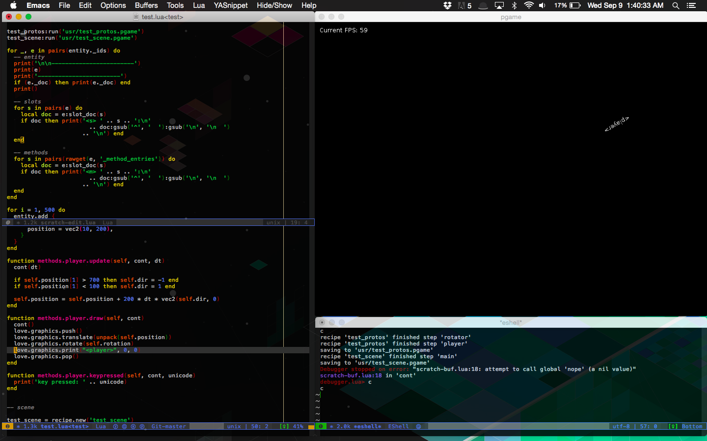

in a world of actualities, not cloudy abstractions, work by example -- make an
example of the monster, then inherit -- a 'proto' -- and now the abstraction is
a tangible object that is manipulable as data in an editor 

another attempt at reducing creative friction between the artist and the artwork


ideas
-----

+ todo:
    - conceptual docs (see 'terms' below)

    - gui
        - rect
        - text
        - event capture
        - alignment (vertical/horizontal tabular)
        - focus
        - textedit (based on text?)
        - button (rect + text)
        - input (rect + textedit)
    - inspectors
    - clone object, move slot, inspect multiple objects, force inherit slot, etc.
    - in-game output console
    - sprite

    - automatically maintain 'methods.x' as a proto for 'entities.x' (?)
    - docs for 'entity'
    - fix 'slot deletion' to remove metadata too
    - ensure that code in 'lib.entity' actually doesn't assume 'entity' as an
        rproto

+ potential:
    - coroutines for `cont()` instead of `entity._proto_order()`
    - use luasocket for scratch handling and add interop with non-emacs editors

+ future:
    - individual 'pause/play' and 'visible/invisible' icons (toggling 'updating'
      and 'drawing') in object inspectors
        - when editing 'player' trait you might toggle its visibility to see it,
          but you'd probably never toggle its update


how to play
-----------

Make sure you have [love2d](https://love2d.org/).

```
git clone https://github.com/nikki93/pgame
cd pgame
```

Running simply `love .` will load the boot image `boot/boot.pgame`, which is
created from the `bootstrap` recipe as described in the code in `boot/`. To
recreate this image you can run `love . --bootstrap new_boot.pgame`, which dumps
`new_boot.pgame` as a new boot image. The boot image contains basic entities
such as `entity`, `update` and `transform`.

A different boot image can be loaded with `love . --boot input_image.pgame`. So
you could load the default boot image, modify the world a bit, save a new one,
then load that in the future.

The first of the remaining arguments gives a directory to load methods from,
then the rest of them should name images to be loaded in order.


terms
-----

will write docs defining everything soon...

+ core
    - entity
    - id, name
    - slot
    - method
    - proto, rproto, sub, rsub

    - entity descriptor
    - slot descriptor

    - image
    - recipe

+ game
    - trait
    - event


how to design entities
----------------------

for any entity that you think will have rsubs, keep asking the question:
    what behavior are entities that derive from me endowed with?
this gives you the documentation of the entity, and the entity is defined by its
documentation--it must be expressed both in implementation by code and
explanation to the user through documentation

if adding an entity as an rproto doesn't change observable behavior, then it is
accidental complexity


documentation policy
--------------------

document early--use documentation as a way to formalize the definition of an
entity and actually help coding--any error in the documentation is either a bug
in the code for not matching the documentation, or an error in the documentation
for not matching the idea

think of it this way: the purpose of an idea is to be realized, and this happens
by documenting it, because the purpose of code is to make documentation true (it
isn't true, but the point is to work with such belief)

documentation must be well organized:
  - have per-entity documentation of what the instance represents by itself (if
    it isn't simply a trait), what rsubs are endowed with and under what
    conditions, and a todo section for what future work needs to be done
  - have per-slot and per-method documentation

documentation must be /written/ close to its code, it can then be collected in
other ways for viewing--writing close to code ensures some level of
code<->documentation invariant maintenance--don't document behavior of other
entities in this entity (use 'see: ') etc.--so, docstrings!

as much as possible documentation should be in docstring form however
abstract--if you have outside-code abstract ideas are just ideas and not a
realization of them (of course, it's ok for the design process)

the vision is to store documentation in entities so that it can be queried
through the system (i.e., inspect an entity, ask for its main documentation,
documentation or a slot or method, for the filename of the function associated
with the method (see lua's `debug.getinfo(...)`)

the documentation could be more than plaintext--link to other entities (opens
inspector), potentially include formatting/images, a 'realtime preview' rendered
through a camera following the object--all this will be drawn in the
documentation viewer

for now entities are mentioned by name like `name` and their slots by
`name:slot` or `name.slot`

(perhaps this documentation network could be exported to markdown/HTML?)

